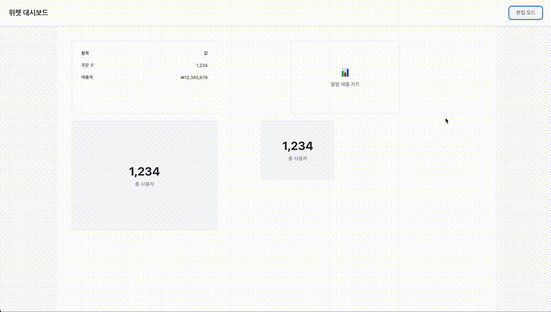

# Widget Dashboard

유연한 위젯 대시보드와 드래그앤드롭 기능을 제공하는 React 라이브러리입니다.



## 주요 기능

- 픽셀 단위 정확한 위치/크기 저장
- 20px 그리드 스냅으로 부드러운 이동과 리사이즈
- 편집 모드에서 바둑판 격자 시각적 가이드
- 완전 커스텀 위젯 컴포넌트 지원
- 편집/보기 모드 전환

## 설치

```bash
npm install widget-dashboard
```

## 사용법

### 기본 사용법

```tsx
import React, { useState } from 'react';
import { WidgetDashboard, WidgetLayout } from 'widget-dashboard';

// 커스텀 위젯 컴포넌트
const MetricWidget = () => (
  <div style={{ 
    padding: '20px',
    background: '#f8f9fa',
    borderRadius: '8px',
    height: '100%',
    display: 'flex',
    alignItems: 'center',
    justifyContent: 'center',
    border: '1px solid #e9ecef'
  }}>
    <div style={{ textAlign: 'center' }}>
      <div style={{ fontSize: '32px', fontWeight: 'bold', color: '#212529', marginBottom: '8px' }}>1,234</div>
      <div style={{ fontSize: '14px', color: '#6c757d' }}>총 사용자</div>
    </div>
  </div>
);

const ChartWidget = () => (
  <div style={{ 
    padding: '20px',
    background: '#ffffff',
    borderRadius: '8px',
    height: '100%',
    display: 'flex',
    alignItems: 'center',
    justifyContent: 'center',
    border: '1px solid #e9ecef'
  }}>
    <div style={{ textAlign: 'center' }}>
      <div style={{ fontSize: '24px', marginBottom: '8px' }}>📊</div>
      <div style={{ fontSize: '14px', color: '#6c757d' }}>월별 매출 차트</div>
    </div>
  </div>
);

// 위젯 레이아웃 정의
const [layouts, setLayouts] = useState<WidgetLayout[]>([
  {
    id: '1',
    title: '사용자 지표',
    position: { x: 0, y: 0 },
    size: { width: 200, height: 120 },
    children: <MetricWidget />,
  },
  {
    id: '2',
    title: '매출 차트',
    position: { x: 200, y: 0 },
    size: { width: 300, height: 200 },
    children: <ChartWidget />,
  },
]);

// 대시보드 컴포넌트 사용
function App() {
  const [isEditMode, setIsEditMode] = useState(false);

  const handleLayoutsChange = (newLayouts: WidgetLayout[]) => {
    setLayouts(newLayouts);
    console.log('레이아웃 변경:', newLayouts);
  };

  return (
    <div className="App">
      <div className="app-header">
        <h1>위젯 대시보드</h1>
        <button onClick={() => setIsEditMode(!isEditMode)}>
          {isEditMode ? '보기 모드' : '편집 모드'}
        </button>
      </div>
      
      <WidgetDashboard 
        layouts={layouts}
        isEditMode={isEditMode}
        onLayoutsChange={handleLayoutsChange}
        width={1200}
        height={800}
        gridSize={20}
      />
    </div>
  );
}
```

## API

### WidgetDashboard Props

| Prop | Type | Default | Description |
|------|------|---------|-------------|
| `layouts` | `WidgetLayout[]` | `[]` | 위젯 레이아웃 배열 |
| `isEditMode` | `boolean` | `false` | 편집 모드 활성화 여부 |
| `onLayoutsChange` | `(layouts: WidgetLayout[]) => void` | - | 레이아웃 변경 콜백 |
| `width` | `number` | `1200` | 대시보드 너비 (px) |
| `height` | `number` | `800` | 대시보드 높이 (px) |
| `gridSize` | `number` | `20` | 그리드 크기 (px) |

### WidgetLayout Interface

```tsx
interface WidgetLayout {
  id: string;                    // 고유 식별자
  title?: string;                // 위젯 제목 (선택사항)
  position: {
    x: number;                   // X 좌표 (px)
    y: number;                   // Y 좌표 (px)
  };
  size: {
    width: number;               // 너비 (px)
    height: number;              // 높이 (px)
  };
  children?: React.ReactNode;    // 위젯 내용 컴포넌트
  className?: string;            // 추가 CSS 클래스 (선택사항)
}
```

## 고급 사용법

### 다양한 크기의 대시보드

```tsx
// 작은 대시보드
<WidgetDashboard 
  layouts={layouts}
  isEditMode={true}
  width={800}
  height={600}
  gridSize={20}
/>

// 고정 너비 컨테이너
<div style={{ width: '600px', height: '400px', margin: '0 auto', border: '1px solid #ccc' }}>
  <WidgetDashboard 
    layouts={layouts}
    isEditMode={true}
    width={600}
    height={400}
    gridSize={20}
  />
</div>
```

### 레이아웃 저장 및 복원

```tsx
// 레이아웃 저장
const saveLayouts = () => {
  localStorage.setItem('dashboard-layouts', JSON.stringify(layouts));
};

// 레이아웃 복원
const loadLayouts = () => {
  const saved = localStorage.getItem('dashboard-layouts');
  if (saved) {
    setLayouts(JSON.parse(saved));
  }
};

// 레이아웃 변경 시 자동 저장
const handleLayoutsChange = (newLayouts: WidgetLayout[]) => {
  setLayouts(newLayouts);
  saveLayouts();
};
```

### 동적 위젯 추가/제거

```tsx
const addWidget = () => {
  const newWidget: WidgetLayout = {
    id: `widget-${Date.now()}`,
    title: '새 위젯',
    position: { x: 0, y: 0 },
    size: { width: 200, height: 120 },
    children: <NewWidgetComponent />,
  };
  setLayouts([...layouts, newWidget]);
};

const removeWidget = (id: string) => {
  setLayouts(layouts.filter(layout => layout.id !== id));
};
```

## 그리드 시스템

- 모든 위젯은 20px 단위로 정확히 스냅됩니다
- 드래그와 리사이즈 모두 20px 단위로 움직입니다
- 격자 선에 완벽하게 정렬됩니다

### 권장 위젯 크기

```tsx
// 작은 위젯
size: { width: 100, height: 80 }

// 중간 위젯
size: { width: 200, height: 150 }

// 큰 위젯
size: { width: 300, height: 200 }

// 매우 큰 위젯
size: { width: 400, height: 300 }
```

## 주의사항

1. 각 위젯은 고유한 `id`를 가져야 합니다
2. 위치와 크기는 `gridSize`의 배수로 설정하는 것을 권장합니다
3. 위젯이 대시보드 경계를 벗어나지 않도록 자동으로 제한됩니다
4. 많은 위젯을 사용할 때는 성능을 고려하여 적절한 수로 제한하세요

## 라이선스

MIT 라이선스

## 지원

문제가 있거나 기능 요청이 있으시면 [GitHub Issues](https://github.com/1rreplaceable/widget-dashboard/issues)에 등록해 주세요.
